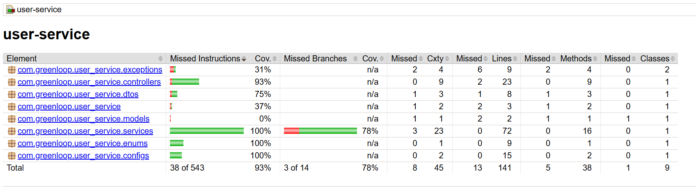

Perfect — since your **User Service** follows the same structure, CI/CD pipeline, and tooling as your **Auth Service**, I’ll rewrite your README so it mirrors that style and completeness, keeping your project details accurate.

Here’s the updated version 👇

---

# 👤 User Service

## 📖 API Documentation

The User Service includes **Javadoc-generated API documentation** for all public classes and methods.

* **Location:** [`docs/apidocs/index.html`](https://cs464-recycle-proj.github.io/user-service/apidocs/index.html)
* **Usage:** View endpoints, method signatures, and comments for developers integrating or contributing to the User Service.
* **Example:** Open directly in your browser:

```bash
# From repo root
open docs/apidocs/index.html   # Mac/Linux
start docs\apidocs\index.html  # Windows
```

> 💡 Keep this folder updated by running: `mvn javadoc:javadoc`

---

### 🧭 Swagger / OpenAPI

Interactive REST API documentation is provided via **SpringDoc OpenAPI**.

* **Endpoints:**

  * OpenAPI JSON: `/v3/api-docs`
  * Swagger UI: `/swagger-ui.html`

Open locally:

```
http://localhost:8082/swagger-ui.html
```

---

## 📊 Test Coverage

The project includes **unit and integration tests** with coverage reports generated using **JaCoCo**.

* **Current coverage:** 93%



To regenerate coverage reports:

```bash
./mvnw clean test jacoco:report
open target/site/jacoco/index.html
```

---

## 📘 Description

**user-service** is a Spring Boot–based microservice responsible for **user profile and interest management** within the GreenLoop ecosystem.

Key features include:

* **User CRUD operations** (create, update, view, delete profiles)
* **Interest management** (store and retrieve user interests for recommendations)
* **Event participation tracking** (registered and attended events)
* **Avatar management** via a dedicated endpoint
* **Integration with Gateway Service**, which injects authenticated user details in headers (`X-User-ID`, `X-User-Email`, `X-User-Role`)

**Service Port:** `8082`
**Database:** Supabase (PostgreSQL) – Schema: `user_service`

---

## 🚀 Getting Started

### Prerequisites

* Docker & Docker Compose
* Java 21
* Maven (wrapper included)
* `.env` file with environment variables

### Environment Variables

Create `.env` in the `user-service` folder:

```env
DATABASE_URL=jdbc:postgresql://your-supabase-host.pooler.supabase.com:5432/postgres?sslmode=require
DATABASE_USERNAME=postgres.your_project_id
DATABASE_PASSWORD=your_database_password
```

See `.env.example` for a complete template.

---

## ⚙️ Configuration

### Application Properties

* **Server Port:** `server.port=8082`
* **Database:** PostgreSQL connection (from environment variables)
* **Hibernate:** `ddl-auto=update` (use `validate` in production)
* **Schema:** `user_service`
* **Actuator:** Health and info endpoints exposed (`/actuator/health`, `/actuator/info`)

---

## 🧪 Testing

```bash
# Run all tests
./mvnw test

# Run tests + generate coverage
./mvnw test jacoco:report

# Run specific test class
./mvnw test -Dtest=UserServiceTest
```

### Unit Tests

* `UserServiceTest` – Service layer unit tests with mocked repositories

### Integration Tests

* `UserControllerTest` – REST controller integration tests with MockMvc

---

## 🧩 Integration

This service integrates seamlessly with the **Gateway Service** and other GreenLoop microservices:

* Accepts authenticated requests with headers injected by Gateway:

  * `X-User-ID`
  * `X-User-Email`
  * `X-User-Role`
* Supports inter-service communication for event participation and recommendations.

---

## 🔄 CI/CD Workflow

### Overview

1. **Build and Test**

   * JDK 21 setup, Maven caching
   * Compile and run unit tests
   * Upload test and coverage reports

2. **Code Quality**

   * Runs **Checkstyle** and **SpotBugs**
   * Performs **SonarCloud** analysis on `main` branch

3. **Docker Build**

   * Builds Docker image `greenloop-user-service:test`
   * Performs health check with `curl`
   * Pushes image on `main` branch

4. **Security Scans**

   * Uses **Trivy** and **OWASP Dependency Check**
   * Uploads scan reports as artifacts

---

## 🧱 Tech Stack

* **Java 21**
* **Spring Boot 3**
* **Spring Data JPA**
* **Supabase (PostgreSQL)**
* **Docker-ready**
* **Maven**
* **JaCoCo**, **Checkstyle**, **SpotBugs**, **SonarCloud**

---

## ⚙️ Static Analysis

### SpotBugs

```bash
./mvnw spotbugs:gui
./mvnw clean compile spotbugs:check
```

### Checkstyle

```bash
./mvnw checkstyle:check
```

### Javadoc & Coverage

```bash
./mvnw javadoc:javadoc
open target/site/apidocs/index.html

./mvnw clean test jacoco:report
open target/site/jacoco/index.html
```

---

## 📊 Monitoring

**Health Checks**

```bash
curl http://localhost:8082/actuator/health
curl http://localhost:8082/actuator/info
```

**Dockerfile Health Check**

```dockerfile
HEALTHCHECK --interval=30s --timeout=3s --start-period=40s --retries=3 \
  CMD wget --no-verbose --tries=1 --spider http://localhost:8082/actuator/health || exit 1
```

---

## 🧠 Best Practices

* ✅ Javadoc for all public methods
* ✅ Consistent DTO and entity mapping
* ✅ Centralized exception handling
* ✅ Input validation & null checks
* ✅ Security-first design
* ✅ Code style via Checkstyle

---

## 👥 Contributing

1. Add Javadoc for new classes/methods
2. Write or update unit tests
3. Update README for new features
4. Follow the existing coding style

---

**GreenLoop User Service** | Version 1.0 | Java 21 | Spring Boot 3.5.6